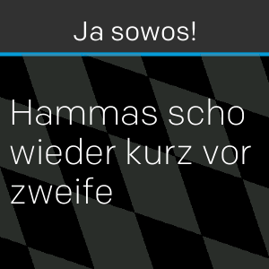

# Fitbit Watchface Boarisch

A oafache boarische Uhr - süffig, bärig, guad.

Wemma oamoi aufd Uhr tippt werd de genaue Uhrzeit ozoagt.

Aktuell is ois in Oberboarisch ghoit'n. Wennts es de Uhr a spezifischer in Niederboarisch, Allgäuerisch etc. hom megts, dann schreibt's ma gern a Mail und i bau eichane Übersetzungen ei.

Außerdem gibt's de Uhr zurzeit nur fia Fitbit Versa-Modelle und ned fiad Ionic. Bei Interesse schreibts ma einfach, dann bass i's entsprechend o.

----- For English speakers (and other Preißn)
This clockface is localized in Bavarian. Feel free to use it to improve your Bavarian skills!